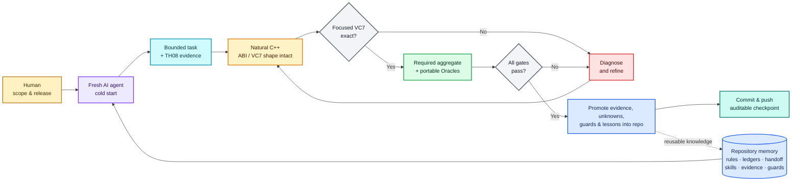

# 東方永夜抄 ～ Imperishable Night

<p align="center">
  
</p>

<p align="center">
  
</p>

> [!IMPORTANT]
> 🌙 The authored reconstruction is complete, and the Linux port is playable.
> Download [TH08 Reconstruction v0.2.0 — Native Linux 64-bit](https://github.com/N0zoM1z0/th08/releases/latest);
> active ELF64 source lives on
> [`port/portable-64bit`](https://github.com/N0zoM1z0/th08/tree/port/portable-64bit).
> Windows and macOS ports remain in progress.

## Repository status

This repository reconstructs the original Japanese
`東方永夜抄 ～ Imperishable Night` version 1.00d executable. Every one of the
1,107 authored functions now has source. Strict comparison currently accepts
1,106 of them, covering 459,396 of 459,757 authored bytes.

| Area | Status | Current position |
| --- | --- | --- |
| Authored source | **Complete** | 1,107 / 1,107 functions are present in source |
| Strict authored comparison | **99.92% by bytes** | 1,106 / 1,107 functions are accepted as exact |
| Whole executable | **In progress** | PE layout, linked runtime/library code, and one authored near match remain |
| Web | **Playable** | Public WebAssembly/WebGL 2 build |
| Linux | **Playable** | Native i386; x86_64/AArch64 work on `port/portable-64bit` |
| Windows | **In progress** | Native startup and redistributable packaging are incomplete |
| macOS | **In progress** | Native backend and packaging have not been implemented |

Exact reconstruction and the playable ports are tracked separately. Running
on a modern platform does not make the code byte-exact, and having source for a
function does not make it a match. The progress bar counts accepted authored
bytes; the platform cards show which ports are currently usable.

The remaining exact-reconstruction work is the last authored near match,
whole-image layout, and the compiler/runtime and D3DX code linked into the
original game. Live counts come from the repository ledgers, not from this
README.

## Built by AI agents, judged by reproducible evidence

This is not a conventional human-written decompilation with a little AI help
around the edges. All new engineering in this continuation—reverse
engineering, source matching, semantic recovery, tooling, documentation, and
porting—is carried out by AI coding agents. The human maintainer sets the
direction, controls what is published or merged, and supplies the legally
obtained target and game data. The imported GensokyoClub history remains the
work of its original contributors; we do not relabel their authorship.

Our starting point in 2026 is that frontier coding agents are capable of
sustained native-code reconstruction, provided they work inside an environment
with good memory, narrow tasks, strong tools, and feedback that can prove them
wrong. We do not assume that an agent is correct because its output looks
plausible. In this project, an agent writes the hypothesis; the target and the
toolchain decide whether it survives.

The most important design rule is simple: **the repository—not a person's
memory and not an AI chat session—is the project's memory.** Knowledge,
experience, and lessons from failed attempts should accumulate in forms that
the next contributor can find, review, rerun, and improve. Chat is useful
scratch space, but a conclusion that lives only in chat is not durable project
knowledge. If it matters, it must be promoted into source, a ledger, a focused
evidence note, a script, a test, a guard, or a reusable skill.



The “Oracle” in that diagram is a stack of checks, not an agent's confidence
score. We pin the exact Japanese 1.00d executable by size and SHA-256, compare
the smallest affected VC7 function or object, and verify relocations as well as
instruction bytes. A shared change then triggers a clean, single-job rebuild
of every configured comparison object and a replay of the whole accepted
ledger. Normal VC7 linking, modern Linux builds, fixed-layout checks, available
runtime tests, and repository CI catch different classes of failure. A result
does not become “exact” because an agent—or a maintainer—says that it is.

Repository memory is not documentation added after the real work; it is part
of the working architecture. We do not rely on one long chat or on an agent
remembering what a previous agent discovered:

- [AGENTS.md](AGENTS.md) holds the non-negotiable target, ABI, safety, and
  acceptance rules.
- The CSV/TOML ledgers and status scripts hold live mappings and accepted
  results; prose never overrides them.
- [The current handoff](docs/RE_HANDOFF.md) says what is complete, what is
  blocked, and what should happen next.
- [Task-specific skills](.agents/skills/) and
  [the knowledge map](docs/KNOWLEDGE_BASE.md) preserve tool recipes, VC7 source
  patterns, evidence boundaries, and lessons from failed experiments.
- Focused evidence documents explain why a name, layout, function boundary, or
  compiler shape was accepted, while CI guards completed surfaces against
  regression.

That makes agents interchangeable without making the work uncontrolled. A new
agent can verify the target, read the tracked state, run the live reports, and
resume from a clean checkout without needing the previous conversation. The
project may pass through many agents over time, but reconstruction writes and
Wine/VC7 matching are deliberately single-writer and serial. This avoids
overlapping edits, stale objects, and shared-toolchain contamination while
keeping handoffs cheap.

The model can still make a bad inference. The architecture is designed around
that fact: keep the task small, make the claim falsifiable, reject failed
experiments, preserve uncertainty, and commit the evidence that lets the next
agent check the work again. That is what we mean here by AI reconstruction.

## What we mean by semantic reconstruction

Matching the executable is necessary, but it is not the finish line. Source can
reproduce every byte and still be miserable to read if it expresses the game
as object offsets, anonymous fields, bare masks, and numbered interpreter
cases. Our semantic pass is the work of recovering those meanings and putting
them back into the C++.

Accuracy comes first. We add a type or name only when TH08 itself supports it
through reads, writes, callers, or state transitions. TH06, TH07, and the
inherited upstream names are very useful clues, but they never overrule the
Japanese TH08 1.00d target. If a meaning is still uncertain, the source says so
instead of guessing.

There is another wrinkle: two equivalent-looking C++ expressions do not always
produce the same VC7 code. Under `/Ob0`, even a small helper or a reordered
`switch` can change the output. We therefore keep the target-shaped expression
or case order when exact emission depends on it. A prettier rewrite that loses
an accepted match does not make the cut.

Every semantic batch is checked in both directions. The VC7 comparison makes
sure accepted target bytes stay exact; the modern builds make sure the same
source still works as portable C++. Shared changes are rebuilt on Linux and
checked against the fixed-layout verifier, with relevant runtime tests used
when they are available.

To see whether this pass had actually improved the source, we did a best-effort
audit across the repository and compared the same kinds of interpreter code
with [GensokyoClub/th06](https://github.com/GensokyoClub/th06), our
adjacent-engine reference:

| Comparable protocol surface | This TH08 reconstruction | GensokyoClub/th06 reference |
| --- | ---: | ---: |
| ECL operand selectors | **101 / 101 named** | 25 named `EclVarId` values |
| Stage/background stream opcodes | **35 / 35 named** | 6 named `StageOpcode` values |
| ECL timeline opcodes | **17 / 17 named** | 11 numeric `case` labels remain |

On these measurable surfaces, TH08 now genuinely **outperforms the TH06
reference in readability coverage**. TH08 also has names for all 184 primary
ECL opcodes, the complete interpolation and camera-mode domains, replay event
bits, stable sound and resource protocols, and the small UI/gameplay state
machines found during the audit. CI guards these finished surfaces so they do
not quietly drift back to numeric dispatch.

That comparison is a benchmark, not a knock on TH06 or its contributors. We
also did not turn every remaining number into an enum just to improve a count.
At the end of the audit, the 74 numeric `case` labels left in the source were
option-array indices, damage or life quantities, or per-file animation IDs
whose visual meaning was not securely known. Giving them confident names would
be guesswork. For us, accuracy first means the most readable source the evidence
allows—not the source with the most labels.

The final pass cold-built all 75 configured comparison objects and reproduced
**1,106 / 1,106 accepted exact functions** with no failures. The normal VC7
image linked, and the full Linux i386 build and fixed-layout check passed. The
[semantic reconstruction record](docs/SEMANTIC_RECONSTRUCTION.md) has the full
evidence trail, the exact-safe source-shape rules, the unknowns we kept, and the
results for each batch.

## Contributing

Contributions are welcome. We are especially interested in:

- evidence-backed exact reconstruction and whole-image layout work;
- reliable native Windows startup and replacement of the non-redistributable
  D3DX debug dependency;
- a native macOS window, input, audio, renderer, and packaging backend;
- Linux renderer fixes, MIDI support, and testing on additional hardware;
- browser correctness, performance, and compatibility work in
  [N0zoM1z0/th08-web](https://github.com/N0zoM1z0/th08-web).

Before changing reconstruction state, read [AGENTS.md](AGENTS.md),
[the reverse-engineering workflow](docs/RE_WORKFLOW.md), and
[the current handoff](docs/RE_HANDOFF.md). Exact-match contributions must be
supported by reproducible comparison against the specified target. Never
commit the original executable, DAT archives, extracted retail assets, private
analysis databases, or credentials.

## Platform guides

The ports compile the reconstructed game code for modern systems. They do not
include the original executable or game archives, so players must provide data
from a legally obtained copy of TH08.

### Web

**Status: Playable**

<p align="center">
  <a href="https://th08-web.pages.dev/">
    
  </a>
</p>

[Play in the browser](https://th08-web.pages.dev/) ·
[source and documentation](https://github.com/N0zoM1z0/th08-web) ·
[latest release](https://github.com/N0zoM1z0/th08-web/releases/latest) ·
[engineering the Web port](https://github.com/N0zoM1z0/th08-web/blob/main/docs/WEB_PORTING.md)

TH08 Web compiles the reconstructed C++ with Emscripten and runs it as
WebAssembly in a browser worker. It uses WebGL 2, Web Audio, browser-local
files, and IndexedDB-backed saves. This is not a TypeScript reimplementation,
and it does not emulate the original executable.

Select `th08.dat` and `thbgm.dat` from a legal TH08 installation in the
launcher. `th08.dat` remains in volatile session memory; `thbgm.dat` is
range-read from its browser `File` object. Neither file is uploaded, bundled,
cached by the site, or placed in persistent browser storage. Chrome is
recommended for the best observed frame pacing; Firefox is supported but is
usually slower.

### Linux

**Status: Playable**

- [Download the latest native Linux release](https://github.com/N0zoM1z0/th08/releases/latest)
- [Download, installation, and player guide](docs/PLAY_LINUX.md)
- [Native Linux porting architecture and validation](docs/LINUX_PORTING.md)
- [Native 64-bit branch, build, and validation](https://github.com/N0zoM1z0/th08/blob/port/portable-64bit/docs/PORTABLE_64BIT.md)
- [Portable Linux build workflow](.github/workflows/portable-linux.yml)

On Debian or Ubuntu, build and run against the original game-data directory:

```bash
scripts/setup-modern-linux.sh "/path/to/the/original/TH08 directory"
```

For later runs, use the incremental launcher:

```bash
scripts/play-modern-linux.sh "/path/to/the/original/TH08 directory"
```

The latest release includes x86_64, i386, and experimental AArch64 portable
packages. Extract the package for your architecture and pass the original data
directory:

```bash
./run-th08.sh "/path/to/the/original/TH08 directory"
```

The native i386 ELF has been tested under WSLg and in a Kali Linux x86-64
virtual machine. It requires only `th08.dat` and `thbgm.dat`; it does not open
or execute the original `th08.exe`. Settings, scores, replays, and backups stay
in the selected data directory.

The native-layout x86_64 PIE is the recommended Linux package. Its source is on
[`port/portable-64bit`](https://github.com/N0zoM1z0/th08/tree/port/portable-64bit).
It has been played through a Lunatic Stage 1–6A route, including the ending,
results, and return to title, plus Stage 4A/6B Practice runs under WSLg. The
AArch64 build and loader have been verified, but it still needs a gameplay run
on real hardware.

<p align="center">
  
</p>

> Maintainer bias, openly declared: Kaguya is my favorite, and
> **竹取飛翔 ～ Lunatic Princess** is my favorite track. XD

<p align="center">
  
</p>

The portable window uses the project-owned
[`resources/modern-icon.png`](resources/modern-icon.png), not an icon extracted
from the original executable. On software-rendered systems, a fresh
configuration's fullscreen FPS/vsync calibration can be slow; reusing an
existing `th08.cfg` is optional.

#### Earlier Linux renderer regression

An early Linux build sometimes tiled a dynamic text texture across the outer
frame and HUD during the Stage 4-to-5 transition, most visibly as repeated
`Yakumo Yukari` text. It also had missing enemy/boss art and incomplete effects.
After the native-layout and renderer fixes, none of these problems appeared in
the final x86_64 full-route or Practice runs. We keep the screenshot as a useful
regression sample; please report it if the bug returns on another driver or
desktop.

<p align="center">
  
</p>

### Windows

**Status: In progress**

See the [native Windows guide](docs/PLAY_WINDOWS.md) for the current build and
release requirements. The source can produce a 32-bit MinGW bring-up
executable, but native startup is not yet reliable and the build still depends
on a non-redistributable DirectX SDK debug DLL. There is no supported Windows
release asset yet.

The goal is a native build that accepts any legal TH08 data directory and ships
without Wine or non-redistributable SDK components.

### macOS

**Status: In progress**

See the [native macOS guide](docs/PLAY_MACOS.md) for the current plan. There is
no native executable or package yet; the window, input, audio, rendering, and
packaging work still needs to be implemented and tested on real hardware.

## Exact reconstruction

The exact target is one binary: the original Japanese TH08 version 1.00d. A
localized, patched, trial, or earlier executable is a different target.

This repository is a history-preserving continuation of
[GensokyoClub/th08](https://github.com/GensokyoClub/th08). Its complete Git
history was imported rather than squashed, preserving the original authorship
and contribution record.

### Target executable

Supply your own original executable as `resources/th08.exe`:

| Property | Required value |
| --- | --- |
| Version | Original Japanese 1.00d |
| Size | `840,704` bytes |
| SHA-256 | `330fbdbf58a710829d65277b4f312cfbb38d5448b3df523e79350b879213d924` |
| PE image base | `0x00400000` |
| Entry point | `0x004A619E` |

The executable and game data are copyrighted assets and are not included.
Verify the private target before analysis or comparison:

```bash
python3 scripts/verify-target.py
```

### Build and compare

Initialize the third-party submodules, then create the Visual Studio .NET
2002/DirectX 8 environment. On Linux or macOS:

```bash
git submodule update --init --recursive
./scripts/create_th08_prefix
python3 ./scripts/build.py
```

The prefix helper uses Wine by default. Set `WINE` before invoking it when a
different compatible runner is required. On Windows, use the setup script
directly:

```text
python scripts/create_devenv.py scripts/dls scripts/prefix
python scripts/build.py
```

See [Build and exact matching](docs/BUILD_MATCHING.md) for dependencies,
build modes, reccmp, objdiff, and acceptance rules.

### Analysis and live progress

IDA MCP follows whichever database is open in the GUI and cannot reliably
select a program itself. Use it for TH08 only after the active database passes
[the documented attestation](docs/IDA_MCP.md). Otherwise use target-safe
headless tools and the repository's target-pinned analysis scripts.

Read current figures directly from the ledgers:

```bash
python3 scripts/analysis/report-reconstruction-status.py --summary
```

Source mappings, generated progress artwork, a successful build, or inclusion
in `config/implemented.csv` do not establish exactness. Only an accepted,
reproducible comparison against the verified target supports an exact-match
claim. Generated source-presence and strict-match figures are recorded in
[docs/PROGRESS.md](docs/PROGRESS.md).

## Project map

- [TH08 Web browser port and engineering documentation](https://github.com/N0zoM1z0/th08-web)
- [Linux download, installation, and play guide](docs/PLAY_LINUX.md)
- [Native Windows user guide and status](docs/PLAY_WINDOWS.md)
- [Native macOS user guide and status](docs/PLAY_MACOS.md)
- [Architecture and binary inventory](docs/ARCHITECTURE.md)
- [Reverse-engineering workflow](docs/RE_WORKFLOW.md)
- [Semantic reconstruction and two-oracle acceptance](docs/SEMANTIC_RECONSTRUCTION.md)
- [IDA and analysis safety](docs/IDA_MCP.md)
- [Build and exact matching](docs/BUILD_MATCHING.md)
- [Playable reconstruction ports](docs/PORTING.md)
- [Native Linux playable reconstruction](docs/LINUX_PORTING.md)
- [Tool selection and command recipes](docs/TOOLS.md)
- [Reusable knowledge map and contribution policy](docs/KNOWLEDGE_BASE.md)
- [Current handoff and next milestones](docs/RE_HANDOFF.md)
- [Generated reconstruction progress](docs/PROGRESS.md)
- [Agent operating rules](AGENTS.md)

## Credits and provenance

This continuation exists because of the reconstruction and tooling work by the
contributors to [GensokyoClub/th08](https://github.com/GensokyoClub/th08).
Their commits retain their original author/committer metadata. The upstream
project also credits @EstexNT for porting its `var_order` pragma to MSVC7.

The [N0zoM1z0/th07 reconstruction](https://github.com/N0zoM1z0/th07) supplies
this repository's workflow, structure, target gates, matching, and
documentation model. [GensokyoClub/th06](https://github.com/GensokyoClub/th06)
is adjacent-engine corroboration only; neither reference overrides TH08 target
evidence.

## License

Repository code and documentation are provided under the included MIT License.
This does not grant rights to the original game, executable, or game data.
