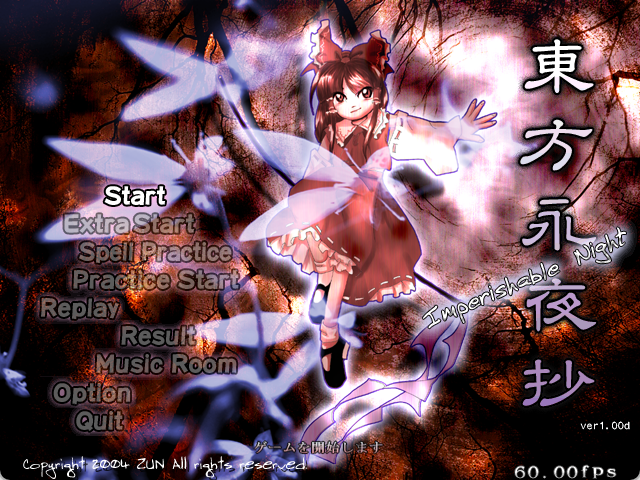
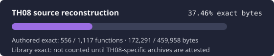
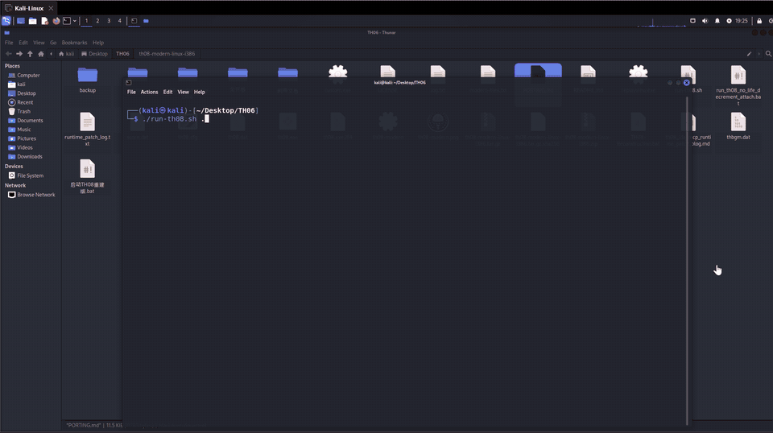
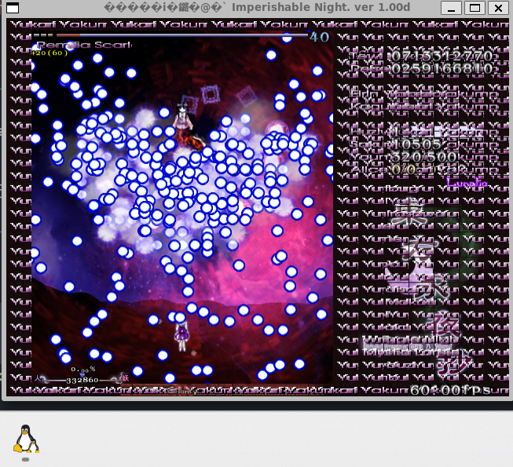

# 東方永夜抄 ～ Imperishable Night

<p align="center">
  
</p>

<p align="center">
  
</p>

> [!IMPORTANT]
> 🌙 The authored reconstruction is complete and Linux is playable. Download
> [TH08 Reconstruction v0.2.0 — Native Linux 64-bit](https://github.com/N0zoM1z0/th08/releases/latest);
> active ELF64 source lives on
> [`port/portable-64bit`](https://github.com/N0zoM1z0/th08/tree/port/portable-64bit).
> Windows and macOS ports remain in progress.

## Repository status

This repository reconstructs the source code of the original Japanese
`東方永夜抄 ～ Imperishable Night` version 1.00d executable. The authored-source
recovery milestone is complete: all 1,107 authored functions are present in
source. Strict comparison currently accepts 1,106 of those functions, covering
459,396 of 459,757 authored bytes.

| Area | Status | Current position |
| --- | --- | --- |
| Authored source | **Complete** | 1,107 / 1,107 functions are present in source |
| Strict authored comparison | **99.92% by bytes** | 1,106 / 1,107 functions are accepted as exact |
| Whole executable | **In progress** | PE layout, linked runtime/library code, and one authored near match remain |
| Web | **Playable** | Public WebAssembly/WebGL 2 build |
| Linux | **Playable** | Native i386; x86_64/AArch64 work on `port/portable-64bit` |
| Windows | **In progress** | Native startup and redistributable packaging are incomplete |
| macOS | **In progress** | Native backend and packaging have not been implemented |

The exact-reconstruction lane and the playable-port lanes are independent.
Running on a modern platform is not an exactness claim, and source presence is
not counted as a byte-exact result. The progress bar above visualizes accepted
authored bytes only; its platform cards report delivery status separately.

Current reconstruction work focuses on the remaining authored near match,
whole-image layout, and target-linked compiler/runtime and D3DX code.
Live authored and library figures come from the repository ledgers rather than
this README.

### Contributing

Contributions are welcome. Useful areas include:

- evidence-backed exact reconstruction and whole-image layout work;
- reliable native Windows startup and replacement of the non-redistributable
  D3DX debug dependency;
- a native macOS window, input, audio, renderer, and packaging backend;
- Linux renderer fixes, MIDI support, and testing on additional hardware;
- browser correctness, performance, and compatibility work in
  [N0zoM1z0/th08-web](https://github.com/N0zoM1z0/th08-web).

Before changing reconstruction state, read [AGENTS.md](AGENTS.md),
[the reverse-engineering workflow](docs/RE_WORKFLOW.md), and
[the current handoff](docs/RE_HANDOFF.md). Exact-match contributions must be
supported by reproducible comparison against the specified target. Never
commit the original executable, DAT archives, extracted retail assets, private
analysis databases, or credentials.

## Platform guides

Playable ports compile the reconstructed authored game code for modern hosts.
They do not bundle the original executable or game archives; players must
provide data from a legally obtained copy of TH08.

### Web

**Status: Playable**

<p align="center">
  <a href="https://th08-web.pages.dev/">
    
  </a>
</p>

[Play in the browser](https://th08-web.pages.dev/) ·
[source and documentation](https://github.com/N0zoM1z0/th08-web) ·
[latest release](https://github.com/N0zoM1z0/th08-web/releases/latest) ·
[engineering the Web port](https://github.com/N0zoM1z0/th08-web/blob/main/docs/WEB_PORTING.md)

TH08 Web compiles the reconstructed C++ game code with Emscripten and runs it
as WebAssembly on a browser worker. WebGL 2, Web Audio, browser-local files,
and IndexedDB-backed saves form the platform boundary. It is not a TypeScript
reimplementation and does not emulate the original executable.

Select `th08.dat` and `thbgm.dat` from a legal TH08 installation in the
launcher. `th08.dat` remains in volatile session memory; `thbgm.dat` is
range-read from its browser `File` object. Neither file is uploaded, bundled,
cached by the site, or placed in persistent browser storage. Chrome is
recommended for the best observed frame pacing; Firefox is supported but is
usually slower.

### Linux

**Status: Playable**

- [Download the latest native Linux release](https://github.com/N0zoM1z0/th08/releases/latest)
- [Download, installation, and player guide](docs/PLAY_LINUX.md)
- [Native Linux porting architecture and validation](docs/LINUX_PORTING.md)
- [Native 64-bit branch, build, and validation](https://github.com/N0zoM1z0/th08/blob/port/portable-64bit/docs/PORTABLE_64BIT.md)
- [Portable Linux build workflow](.github/workflows/portable-linux.yml)

On Debian or Ubuntu, build and run against the original game-data directory:

```bash
scripts/setup-modern-linux.sh "/path/to/the/original/TH08 directory"
```

After first-time setup, use the incremental launcher:

```bash
scripts/play-modern-linux.sh "/path/to/the/original/TH08 directory"
```

The latest release provides x86_64, i386, and experimental AArch64 portable
packages. Extract the package for your architecture and pass the original data
directory:

```bash
./run-th08.sh "/path/to/the/original/TH08 directory"
```

The native i386 ELF has been exercised under WSLg and in a Kali Linux x86-64
virtual machine. It requires only `th08.dat` and `thbgm.dat`; it does not open
or execute the original `th08.exe`. Settings, scores, replays, and backups stay
in the selected data directory.

The native-layout x86_64 PIE is the recommended Linux package. Its source is on
[`port/portable-64bit`](https://github.com/N0zoM1z0/th08/tree/port/portable-64bit).
It has completed a Lunatic Stage 1–6A route, ending, results, return to title,
and additional Stage 4A/6B Practice validation under WSLg. AArch64 remains
cross-build and loader verified pending a gameplay run on real hardware.

<p align="center">
  
</p>

> Maintainer bias, openly declared: Kaguya is my favorite, and
> **竹取飛翔 ～ Lunatic Princess** is my favorite track. XD

<p align="center">
  
</p>

The portable window uses the project-owned
[`resources/modern-icon.png`](resources/modern-icon.png), not an icon extracted
from the original executable. On software-rendered systems, a fresh
configuration's fullscreen FPS/vsync calibration can be slow; reusing an
existing `th08.cfg` is optional.

#### Earlier Linux renderer regression

An earlier Linux bring-up build could tile a dynamic text texture across the
outer frame and HUD during the Stage 4-to-5 transition, most visibly as
repeated `Yakumo Yukari` text. The same period exposed missing enemy/boss art
and incomplete effects. These regressions were not reproduced in the final
x86_64 full-route and Practice passes after the native-layout and renderer
fixes. The screenshot remains as a historical regression sample; please report
it if it returns on another driver or desktop.

<p align="center">
  
</p>

### Windows

**Status: In progress**

See the [native Windows guide](docs/PLAY_WINDOWS.md) for the current build and
release requirements. The source can produce a 32-bit MinGW bring-up
executable, but native startup is not yet reliable and the build still depends
on a non-redistributable DirectX SDK debug DLL. There is no supported Windows
release asset yet.

The intended product will run natively, accept an arbitrary legal TH08 data
directory, and ship without Wine or non-redistributable SDK components.

### macOS

**Status: In progress**

See the [native macOS guide](docs/PLAY_MACOS.md) for the planned platform
boundary. No native executable or package exists yet. The port needs macOS
window, input, audio, rendering, and packaging implementations followed by
validation on real hardware.

## Exact reconstruction

The exact target is one binary: the original Japanese TH08 version 1.00d. A
localized, patched, trial, or earlier executable is a different target.

This repository is a history-preserving continuation of
[GensokyoClub/th08](https://github.com/GensokyoClub/th08). Its complete Git
history was imported rather than squashed, preserving the original authorship
and contribution record.

### Target executable

Supply your own original executable as `resources/th08.exe`:

| Property | Required value |
| --- | --- |
| Version | Original Japanese 1.00d |
| Size | `840,704` bytes |
| SHA-256 | `330fbdbf58a710829d65277b4f312cfbb38d5448b3df523e79350b879213d924` |
| PE image base | `0x00400000` |
| Entry point | `0x004A619E` |

The executable and game data are copyrighted assets and are not included.
Verify the private target before analysis or comparison:

```bash
python3 scripts/verify-target.py
```

### Build and compare

Initialize the third-party submodules, then create the Visual Studio .NET
2002/DirectX 8 environment. On Linux or macOS:

```bash
git submodule update --init --recursive
./scripts/create_th08_prefix
python3 ./scripts/build.py
```

The prefix helper uses Wine by default. Set `WINE` before invoking it when a
different compatible runner is required. On Windows, use the setup script
directly:

```text
python scripts/create_devenv.py scripts/dls scripts/prefix
python scripts/build.py
```

See [Build and exact matching](docs/BUILD_MATCHING.md) for dependencies,
build modes, reccmp, objdiff, and acceptance rules.

### Analysis and live progress

IDA MCP follows whichever database is active in the GUI and has no reliable
program selector. Use it for TH08 only after the active database passes
[the documented attestation](docs/IDA_MCP.md). Otherwise use target-safe
headless tools and the repository's target-pinned analysis scripts.

Read current figures directly from the ledgers:

```bash
python3 scripts/analysis/report-reconstruction-status.py --summary
```

Source mappings, generated progress artwork, a successful build, or inclusion
in `config/implemented.csv` do not establish exactness. Only an accepted,
reproducible comparison against the verified target supports an exact-match
claim. Generated source-presence and strict-match figures are recorded in
[docs/PROGRESS.md](docs/PROGRESS.md).

## Project map

- [TH08 Web browser port and engineering documentation](https://github.com/N0zoM1z0/th08-web)
- [Linux download, installation, and play guide](docs/PLAY_LINUX.md)
- [Native Windows user guide and status](docs/PLAY_WINDOWS.md)
- [Native macOS user guide and status](docs/PLAY_MACOS.md)
- [Architecture and binary inventory](docs/ARCHITECTURE.md)
- [Reverse-engineering workflow](docs/RE_WORKFLOW.md)
- [Semantic reconstruction and two-oracle acceptance](docs/SEMANTIC_RECONSTRUCTION.md)
- [IDA and analysis safety](docs/IDA_MCP.md)
- [Build and exact matching](docs/BUILD_MATCHING.md)
- [Playable reconstruction ports](docs/PORTING.md)
- [Native Linux playable reconstruction](docs/LINUX_PORTING.md)
- [Tool selection and command recipes](docs/TOOLS.md)
- [Reusable knowledge map and contribution policy](docs/KNOWLEDGE_BASE.md)
- [Current handoff and next milestones](docs/RE_HANDOFF.md)
- [Generated reconstruction progress](docs/PROGRESS.md)
- [Agent operating rules](AGENTS.md)

## Credits and provenance

This continuation exists because of the reconstruction and tooling work by the
contributors to [GensokyoClub/th08](https://github.com/GensokyoClub/th08).
Their commits retain their original author/committer metadata. The upstream
project also credits @EstexNT for porting its `var_order` pragma to MSVC7.

The [N0zoM1z0/th07 reconstruction](https://github.com/N0zoM1z0/th07) supplies
this repository's workflow, structure, target gates, matching, and
documentation model. [GensokyoClub/th06](https://github.com/GensokyoClub/th06)
is adjacent-engine corroboration only; neither reference overrides TH08 target
evidence.

## License

Repository code and documentation are provided under the included MIT License.
This does not grant rights to the original game, executable, or game data.
